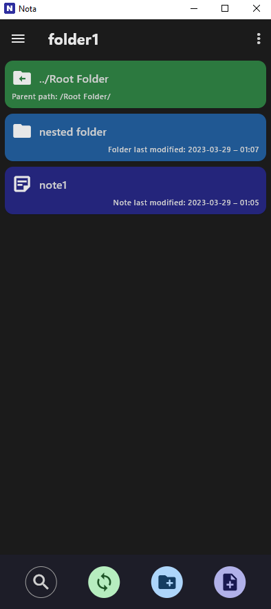

# Nota

## About the App
- Nota is a Cross-Platform Note-Taking app designed to work both locally offline, or server synchronized across 
  all of your devices 
- Nota is focused on the security and privacy of your data and your notes will be securely encrypted, so that the server only
  stores them, but can't read them
  - only your local devices can decrypt and view your notes
- the notes can be accessed inside of the app with a folder like structure
- currently the app is still in development **and is not released** for the app stores yet! 

## Using The App

- Before using the app, you have to create a new account and login to that account 

<p align="center">
  
</p>

- Then you can create notes and folders and navigate through them
- By default those are sorted by name

<p align="center">
  
</p>

- You can of course also edit notes and synchronize the notes with the server 
- And you can also search for file names

<p align="center">
  
</p>

- Additionally on the top right you can open a menu to rename, delete, or move notes and folders except the top level folder 
- You can also open the top left menu to navigate to other views of the notes via the quick access menu
  - the "Root Folder" view shows all of your notes with the folder structure 
  - the "Recent Notes" view which shows all notes without folders sorted by the latest edit
  - other than that you can also mark your own notes, or folders as favourites, so they can also be accessed here
- And of course the app also has some settings like for example activating the dark mode, but also an auto save and an 
  auto login feature 

<p align="center">
  
</p>

- The note selection looks like this on windows in dark mode: 

<p align="center">
  
</p>

### Preview on Windows

- Before installing the app on your phone, you can also use the preview test binaries for windows inside of the folders 
  `nota/example/NotaAppWindows` and `nota/example/NotaServerWindows`
- For the preview, you have to start the server before the app and both must be run on the same windows machine 
- Currently the desktop version is not really supported tho and only looks like the phone version, so this is just for 
  getting a quick first impression of the app! 

## Privacy Policy 

- This short section describes the data collected by the Nota app
- The data is stored in a way that ensures maximum security and privacy
- Because this project is open source, this can always be verified

### Account Information

- The username you enter is stored encrypted locally and on the the server
- Your clear text password is never saved. Only a salted hash of the password is stored encrypted locally and on the server.

### Notes

- The content of the notes is encrypted in a way that it can only be decrypted on your device locally, so the server 
  stores the content, but can't read it. The content is of course also saved the same way locally.
- If you disable the auto login feature, then the key to decrypt the note content will only be kept in memory and it will 
  only be saved encrypted locally if you enable the auto login feature

## Changelog 

### Version 1.1.0 

- improved some internal data handling and updated sdk and package versions and changed the apps bundle id 
- added biometrics login and the possibility to mark notes, or folders as favourites

### Version 1.0.2

- initial release and beginning of changelog 

## Known Issues

- rich text copied to the clipboard from word, or samsung notes, etc cannot be pasted into a text field (todo: maybe 
  try to use a different clipboard manager to fix this problem in the future if it isn't fixed in flutter sdk: https://github.com/flutter/flutter/issues/74320)

## Technical Details on building the projects 

- just import the project in android studio and have the flutter and dart sdks installed and the android studio flutter 
  plugin
  - instead of android studio, you can also use visual studio code with the flutter plugin
- **first run** `dart pub get` inside of each subfolder "shared", "server" and "app"! 
- **then edit the config** like explained [below](#configure-the-projects)
- and afterwards you can use the run configurations in android studio to start the app and the server in debug mode
- This project contains the sub projects **shared**, **server** and **app**

### Building Release Versions 

- when building the release version, you should set the `acceptSelfSignedCertificates` config option to `false` inside of 
  the app and use a trusted tls/ssl certificate instead of a self signed certificate!

#### Server

```
dart compile exe server/lib/main.dart
```

- of course the trusted tls/ssl certificates have to be put into a folder named "notaRes" which has to be put next to the 
  exe!

#### App 

- first navigate into the `nota/app`folder and then use one of the following depending on the platform

```
flutter build windows --release 
flutter build linux --release       
flutter build apk --release           # android 
flutter build ipa --release           # ios 
```


### Configure the projects

- you have to run the run configuration "Create New Keys" at least once, because it will create the "sensitive_data.dart" 
  files inside of the config folders of each project with new random salts and keys
  - then you have to set the server hostname in `/shared/lib/core/config/sensitive_data.dart`
- you also have to add a RSA private key named `key.pem` and the matching certificate named `certificate.pem`in the 
  folder `nota/server/notaRes` for debug mode, or inside of a folder named `data` next to the server exe in release mode
    - if your private key is password protected, you can pass the password to the server exe as a command line argument 
      with `-r "password"`, or `--rsaPassword="password"`
- you can also adjust the log level with `-l "number"`, or `--loglevel="number"` where the number can be 0 for errors 
  only, 1 for warning, 2 for info, 3 for debug, 4 for verbose and 5 for spam

#### Creating a Self-Signed OpenSSL Certificate and Private Key

- first install openssl 
- then open a terminal and navigate to the folder `server/notaRes`
- now enter the command `openssl req -x509 -sha256 -nodes -days 36500 -newkey rsa:4096 -keyout key.pem -out certificate.pem`
- always enter `.` except for the common name, where you can enter anything you want

### Project Structure

#### Server

- contains the server specific code (dart project)
- in the scope of the whole project and in relation to the app, the server is mostly written in the data layer without 
  many use cases
- the server will be build as a command line tool with no gui

#### Shared

- contains the shared code used in server and app (dart project) and should not be used on its own
- this also contains a shared config and shared sensitive data for both projects

#### App

- contains the app specific code (flutter project) written with the "clean architecture"
- this will build the final app for the device with the gui that the user interacts with

### Testing

- some of the server tests can fail on a slow processor, because of some time critical operations
- if this happens, just increase the delays inside of the affected tests

#### Server

- navigate to the `nota/server` folder with the terminal and run `dart test`, or just start the "All Server Tests" run
  configuration
- the default log level for the tests can be changed inside of the file `nota/server/test/helper/server_test_helper.dart` in
  the method `createCommonTestObjects`

#### App

- navigate to the `nota/app` folder with the terminal and run `flutter test`, or just start the "All App Tests" run
  configuration
- the tests of the app also directly use the server tests for the real server responses instead of mocks!
  - because of this, the app tests also don't have to care about the server errors, because they are already tested in
    the server tests
- the default log level for the tests can be changed inside of the file `nota/app/test/helper/app_test_helper.dart` in 
the method `createCommonTestObjects`
